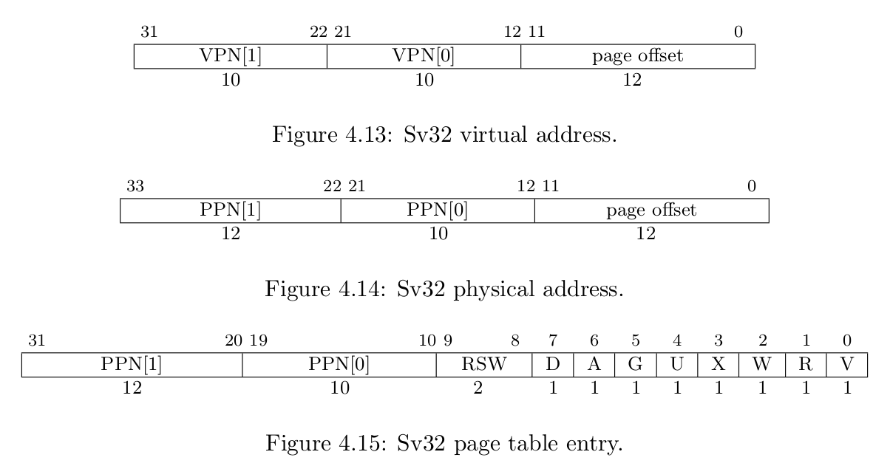
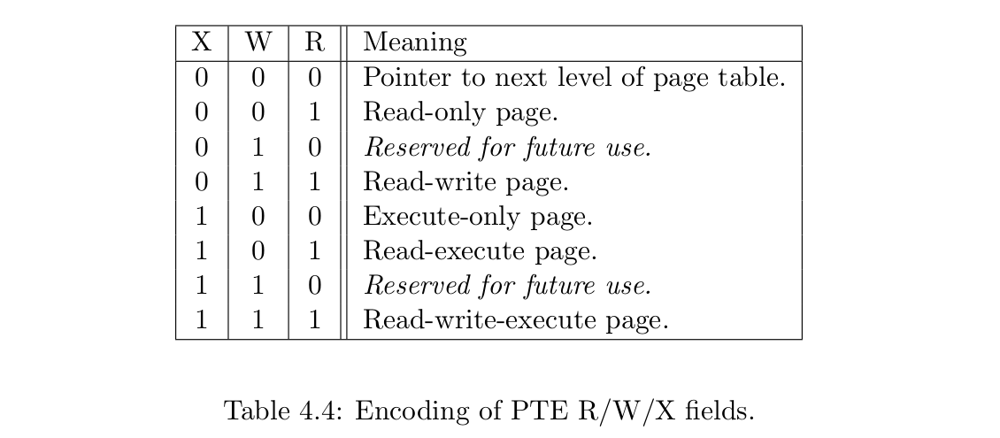
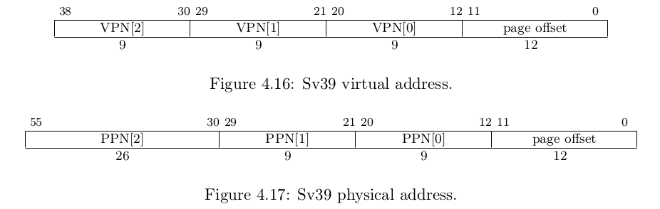
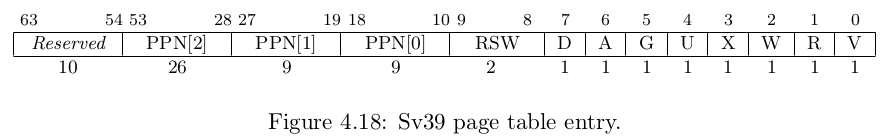
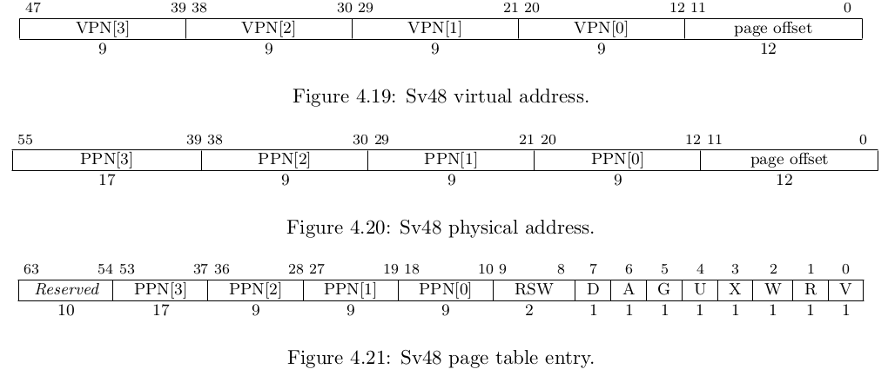
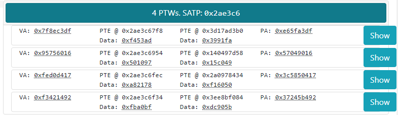
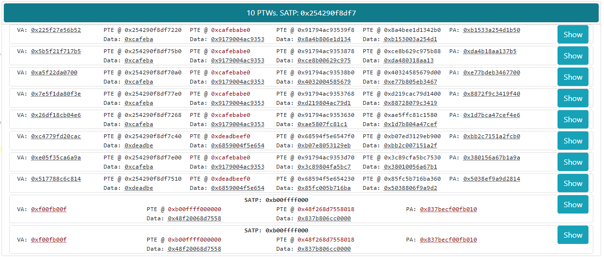

# Table4V: Address Translation Simulation for RISC-V

## Abstract

We present the **Table4V** project. Table4V is a development tool which leverages testing knowledge to create 'interesting' page table walks for verification uses. We aim to provide both an extremely high degree of customization as well as very simple usage for basic cases, so it can be used easily 'out of the box' both for educational settings, as well as in an enterprise setting. It provides both a visual interface for smaller usage as well as the ability to export very large (50,000+ walks) test vectors with command line tools.

## Background

Memory Management Units (MMU) are computer hardware units that are responsible for mapping memory references to physical memory. They offer a number of substantial benefits: they allow virtualization, permission management, and memory defragmentation. They allow address translation -- letting multiple programs that may have the same *logical* address run concurrently. On some platforms, they allowed legacy ISAs to utilize more memory than the address space would otherwise allow. Using the MMU to separate memory references into distinct pages also enables swapfile-type systems to operate. Therefore, as a critical component in modern chipsets, proper verification of MMUs is required. However, like all phases of verification, MMU verification presents its own unique challenges. MMUs need to be tested intependently of the operating system. Since they operate without OS services, they require independent reference address translation mapping.

Table4V originated as an IBM hackathon project, and was greatly expanded and developed upon as a student project.

The core of Table4V is an object-oriented representation of the state of the memory management unit. This, by necessity, is a '_sparse_' representation. As RISC-V is meant to be an expandable, futureproof, and versatile ISA, almost 'one ISA to rule them all', as it were, it accommodates a staggeringly large access space. The most 'normal' virtual memory format, _Sv39_ supports a fairly conventional 512 GB, but the most expansive format, _Sv48_ supports 256 TiB of address space. Any practical setup therefore must rely on sparse simulation -- where PTEs are created when necessary, and are held independently, not in an enormous memory bank. This is the approach taken throughout the project: we create memory representations only once necessary.

A further challenge posed by the size is that it means that we are unlikely to get interesting cases. If, for example, physical addresses were allocated at random, then we would require roughly 20,000,000 allocations to reach a 50% chance of having two programs referring to the same physical address. In practice, however, this is far more likely. For instance, two programs may be given a reference to `libc` or to a system routine they need to call. In the vast void of address space provided by these implementations, it's unlikely that we would see 'interesting' behavior without having some sort of specialized handling of that. Edge cases are highly unlikely to come up in the course of random simulation, and not merely highly likely but rather _certain_ to come up in the course of actual normal usage of a chip.

That is where 'testing knowledge' enters. Randomly generated page table walks are not all that satisfying. They will not turn up our edge cases without bogging down the computers used to simulate or verify under a massive heap of uninteresting tests. We will want something more 'exciting'. In order to achieve that, we enter in another factor. The experience of MMU verifiers yields that there are classes of problems that are much more interesting than just random walks. They include '_aliasing_', where we have multiple virtual references to the same PA. This edge case, as noted above, is almost certain to happen in the course of normal operation, as, for instance, multiple processes may need to access the same syscall. Another is '_pte reuse_', where we have a PTE on different walks, and yet another is '_VA = PA_', where a logical address is equal to the resulting physical address of the page table walk. Yet another is invalid walks -- sometimes programs ask for memory they don't have access to. One of the core responsibilities of the MMU is to prevent privilege escalation and illegal memory accesses, and this needs to be verified as well.

Since experience shows that these edge cases are critical components of MMU verification, we generate them easily -- the user just needs to ask. They can even be combined where they are logically consistent. Thusly, we hope to provide a tool that allows verifiers to leverage their knowledge of the cases that worry them most to create the best test vectors for their needs.

## Project Goals

When this project was initially formulated, there were roughly ten goals in terms of feature support that needed to be added, in addition to broader stability and functionality improvements to the codebase.

1. Making PTEs editable.
1. GUI improvements.
1. Display data and name fields.
1. Assigning fields values with a given probability
1. VA = PA
1. PTE Reuse
1. Aliasing
1. Supporting page ranges (i.e. mapping to many consecutive pages) support
1. Supporting exceptions (all the various things that can go wrong)
1. Using CSP (Constraint Satisfaction Problem) solvers.

Over the course of the project, all initially formulated goals were achieved; with the sole exception of switching to a CSP-based system. After reviewing it carefully, all parties involved with the project agreed that applying CSP to the problem at hand was overkill; that the complexity engendered was not required by the problem, and that a more limited but purposeful method of solving the constraints would be more performant, and easier to implement and maintain. This limited resolver was then implemented and used in this project.

## Introduction

**Table4V** is a development tool which leverages testing knowledge to create 'interesting' page table walks for verification uses. We aim to provide both an extremely high degree of customization as well as very simple usage for basic cases, so it can be used easily 'out of the box'. It provides both a visual interface for smaller usage as well as the ability to export very large (50,000+ walks) test vectors with command line tools.

## The RISC-V Page Table

The RISC-V page table formats can be found in the [`RISC-V Privileged ISA Specification`](https://riscv.org/technical/specifications/). Currently RISC-V supports three types of virtual memory, Sv32 for RV32, Sv39 and Sv48 for RV64, which supports 32-bit, 39-bit and 48-bit virtual address space respectively.

### Sv32 Implementation



The page table format of Sv32 is as above. The page size of Sv32 is 4 KiB, which is a popular page size. Thus, it has a 12-bit long page offset (which enables byte-level addressign). With each page table entry (**PTE**) being 4 bytes, each page table contains 1024 page table entries. The higher 20 bits of the virtual address (virtual page number) is divided into two parts, VPN[0] and VPN[1], 10 bits each to support a two-level page table.

The 20 bits virtual page number is translated into a 22-bit physical page number via a two-level page table. In addition, Sv32 also supports 4 MiB megapages.

The lower 10 bits of a page table entry encodes the ***protection bits*** of this page. The meaning of each bit is as follows:

- V: This bit determines if the remaining bits are valid. When V = 0, any virtual address translation operation that traverses to this page table entry will result in a page fault.
- R: This bit determines whether this page is readable, readable when R = 1.
- W: This bit determines whether this page is writable, writable when W = 1.
- X: This bit determines whether this page is executable, executable when X = 1.
- Note these three together, XWR = 000, marks a pointer PTE. Pointers **must** have XWR = 000.
- U: This bit determines whether this page belongs to the user. If U = 0, U mode cannot access this page. If U = 1, U mode can access this page and S mode can access this page only when ***SUM bit*** in the sstatus register is set. And this bit must be cleared for non-leaf PTEs.
- G: This bit indicates whether this mapping is valid for all virtual address spaces, and the hardware can use this information to improve the performance of address translation. Generally, this bit is only used for pages belonging to the operating system.
- A: Accessed bit, must be cleared for non-leaf PTEs.
- D: Dirty bit, must be cleared for non-leaf PTEs.
- RSW: These two bits are reserved for the operating system and will be ignored by hardware.

Besides, different combinations of R, W and X bits also have special meanings.




## Sv39 Implementation





Sv39 implementations support 39-bit virtual address space, divided into 4 KiB pages. As the PTE of Sv39 has 8 bytes with the highest 10 bits reserved and must be set to 0, there are only 512 rather than 1024 PTEs on one page.

Sv39 uses a three-level page table where the higher bits of the virtual address are divided into three fields of 9 bits each. Bits 63-39 of the virtual address are equal to bit 38 to help the operating system to distinguish the user and supervisor address regions quickly. Sv39 is able to support 2 MiB megapages and 1GiB gigapages.

Otherwise, Sv39 is similar to Sv32.

## Sv48 Implementation



Sv48 supports a 4-level page table and 512 GiB terapages besides 4 KiB pages, 2 MiB megapages, and 1 GiB gigapages. Sv48 implementation is similar to Sv39 implementation in most other respects.

## Virtual Address Translation

Virtual address is translated to physical address level by level.

1. Get the root page table number from the ***satp*** register's PPN field.
2. Find a PTE using the first VPN field of virtual address, and it may raise ***an access exception***.
3. Determined whether it's a valid PTE according to the lowest four bits. If not, raise ***a page-fault exception***. Otherwise, if the XWR bits are all 0, then this PTE is a pointer, and the PPN field is the physical page number of the next level page table. Then it walks the next level page table using the next VPN field, and goes to step 2 again until a leaf PTE is found. If there is no next VPN field, then it will raise a **page-fault exception**.
4. Check whether the memory access is allowed according to PTE bits, current privilege mode and some fields of ***mstatus*** register. If not allowed, raise a **page-fault exception**.
5. If it is not a 4 KiB page, which means there are remaining VPN fields unused before, then check whether the corresponding PPN fields are all 0. If not, raise a **page-fault exception**.
6. Do the remaining work according to the A and D bits and access type, which may raise **an access exception** (If this access violates a PMA or PMP check) or **a page-fault exception**.
7. Get the physical address according to current PTE, current page table level, remaining unused VPN field and the page offset of the virtual address.

## Our Mechanism

The core computation of the address as specified in the documentation is `PPN * PAGESIZE + VPN(i) * PTESIZE`. Another way of thinking of it is essentially just concatenating the VPN (or offset for the final level) bits to the PPN with zero bits for the PTESIZE.

## Usage

### Basics

The basic structure of Table4V is that it fills in empty fields, and it generates cases. The primary interface for Table4V throughout is [JSON5](https://json5.org), a JSON variant which is more 'human-friendly', critically for us, supporting comments, hexadecimal, and easier writing requirements.

#### A Minimal Example

We'll start with a really basic example here. This contains the two mandatory things in our JSON5 spec, `mode` (either 32 / 39 / 48), and `test_cases`, which is a list of all the setups we want. In our case, we only have one item, without anything specified, and then we say `repeats: 4`, which means to repeat this setup four times. `repeats` is **not** mandatory, and if omitted, it defaults to 1.

```json5
{
    mode: 32, // Sv32
    test_cases: [
        { repeats: 4 }
    ]
}
```



The runner will randomly pick a SATP to be used throughout (this can, however, be specified), and then it creates four cases without any constraints, so they'll be filled in at random.

Let's look at a more complex sample now:

```json5
{
    mode: 48, // Sv48
    // You can set the SATP globally:
    satp: 0x254290f8df7, // If you set it as a number, it's interpreted to mean the PPN, ASID is 0. Mode is automatic
    test_cases: [
        {
            repeats: 4,
            ptes: [
                {},
                {
                    address: 0xcafebabe0, // you can set the address of a PTE
                },
            ],
        },
        {
            repeats: 4,
            ptes: [
                {}, // This is empty, to make sure that our case goes into the *second* slot in the PTW
                {
                    // If you use a list where a number is needed, it'll choose a random item from the list
                    address: [0xdeadbeef0, 0xcafebabe0],
                },
            ],
        },
        {
            "repeats": 2,
            "va": 0xf00fb00f,
            "satp.ppn": 0xb00ffff000, // a valid way to specify an SATP PPN.
            // When in a specific case it takes precedence over the global (like here).
            pagesize: ["512G", "1G", "2M"], // Cases can also be set to randomly choose one from a list
        },
    ],
}
```

In this case, we use several features:

- Set the SATP to be a specific value.
- Have several sets of test cases.
- Specify locations of PTEs.
- Randomly choose locations from a specific list.
- Set VAs.
- Randomly choose a pagesize.

The resulting output from this highlights the repeated items (see the red).



### Detailed Usage

Table4V offers the following parameter choices:

- SATP:
    - PPN - this is available as `satp { ppn : ... }` or as `"satp.ppn": ...`. 
    - ASID - this is available as `satp { asid : ... }` or as `"satp.asid": ...`.
    *Note: this is not used in other aspects of the simulator*.

- Virtual Address:
    - VPN: this is available as a list. For instance, `va: { vpn: [0x22, null, 0x33, null]}` is a valid input, where null fields will be randomized or filled in from other values as necessary.
    - Offset: `{va : { offset: 0x131 }}`.
    - Combined: `va: 0xdeadbeef` is a valid way to set the VA entirely. Bits will be allocated throughout the VPN and offset as specified by the field widths.

- Page Table Entries:
    - Placed under `ptes: []`, each dict there should correspond to a PTE.
    - Address: specify the location of the PTE. e.g. `address: 0xf0000ba`.
    - PPNs: `ppns: [...]`.
    - Offset: `offset: ...`.
    - Flags: Available as `attributes`. They can be set individually.
    for example:

        ```json5
            attributes: {
                // Set the flags (RSW, DAGUXWRV) probabilistically on the PTE
                G: 0.5, // Float for probabilities
                U: 1, // 0 - 1 aren't probabilities
                X: 0.5, // Float for probabilities
                W: 0, // 0 - 1 aren't probabilities
                R: 1, // 0 - 1 aren't probabilities
            }
        ```

- Physical Address:
    - Can be set as a whole, `pa: 0x3507235d05a222`.
    - PPNs can be set individually as `pa : { ppn: [...]}`
    - offset can be set individually as `pa : { offset: ...}`

- Errors:
    - An error can be invoked with a probability, set as `p: ...`.
    - Types -- the error types wanted, can be:
        - `"mark_invalid"`
        - `"write_no_read"`
        - `"leaf_as_pointer"`
        - `"uncleared_superpage"`
    - weights: an optional numeric array to weight how often each one will be chosen relative to the others.
    - Example:
        ```json5
            errors: {
                p: 0.5, // overall error probability
                types: [ // list the types you want
                    "mark_invalid",
                    "write_no_read",
                    "leaf_as_pointer",
                    "uncleared_superpage",
                ],
                weights: [1,4,2,5], // weight the error probabilities
            }
        ```

- Testing Knowledge Biases:
    - aliasing: `aliasing: 1` to set, other floats for probability. This is two VAs to the same PA.
    - VA = PA: `same_va_pa: 1` to set, other floats for probability. This is a page table walk where the VA is equal to the resulting PA.
    - 'reuse_pte': `reuse_pte: 1` to set, other floats for probability. This is whether a PTE in this path will be reused from a **previously generated** PTE. **This cannot be used on the first `test_case`**.
    - pagesize: can be set on a test case. `pagesize: ...`. Takes an abbreviated string, e.g. `"2M"`, including a list of them in which case it will randomly choose from the list.
    - "page_range": generates a range of pages.
        Can be invoked either as:
        -  start, end, step

            ```json5
            "page_range": { 
                start: 0x10000,
                end: 0x4000,
                step: 0x2000,
            }
            ```

        or as

        - start, num_pages:
            ```json5
            "page_range": { 
                start: 0x10000,
                num_pages: 100,
            }
            ```
